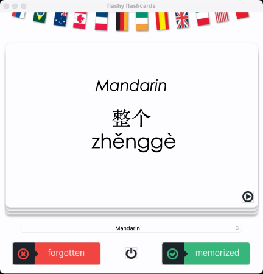
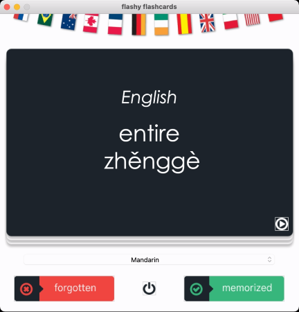
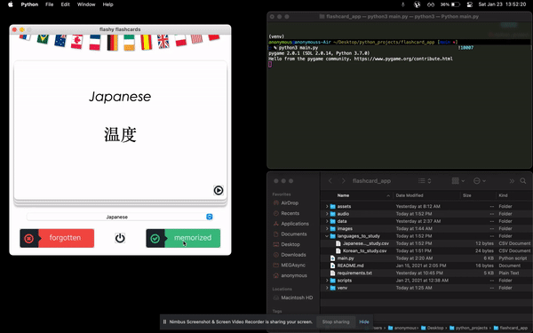

# multi_language_flashcard_app

MAC Application in zip "Multi-lang Flashcards - MAC OS"\
NOTE: PC not available
- Download and double click the icon or run the python file. Instructions below

Run .py file
- Run python main.py
- Select your desired language to learn or study a random one at start up
- Unkown / forgotten words are stored in the languages_to_study directory
- List of languages below and enjoy! :)

Languages:
- Danish
- French
- German
- Japanese
- Korean
- Mandarin
- Romanian
- Russian
- Spanish
- Tagalog
- Thai
- Vietnamese